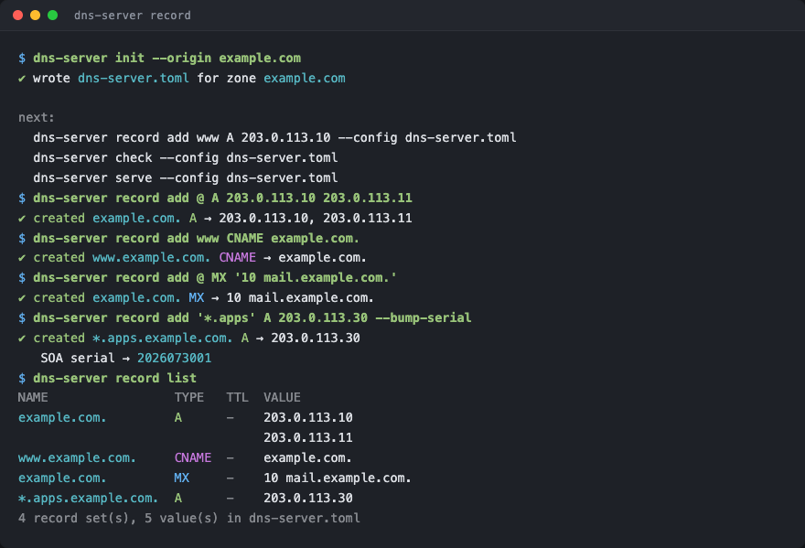
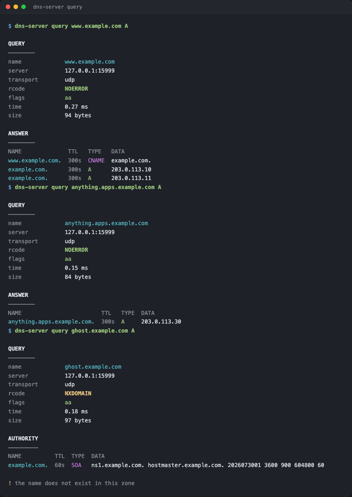
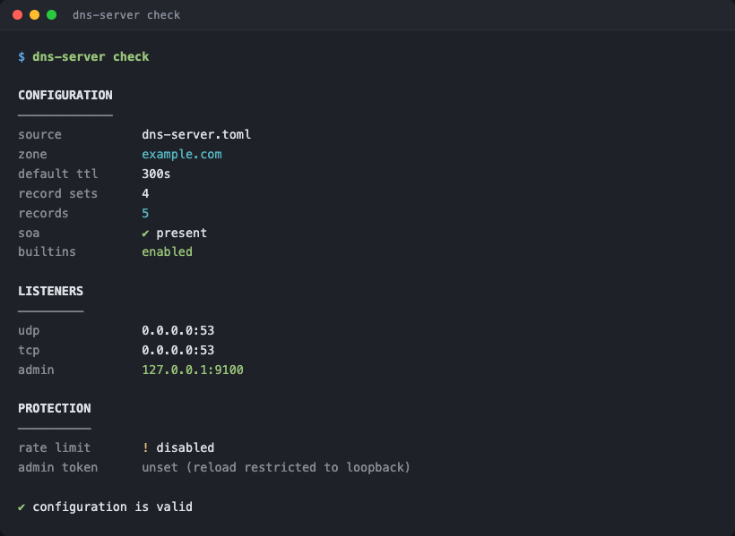
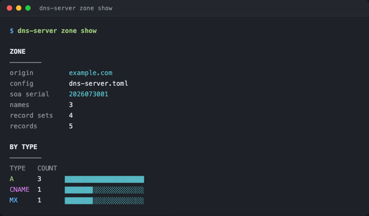
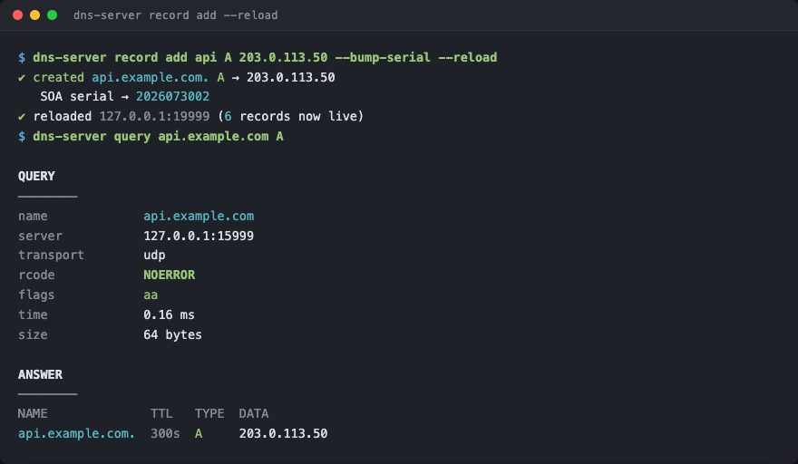
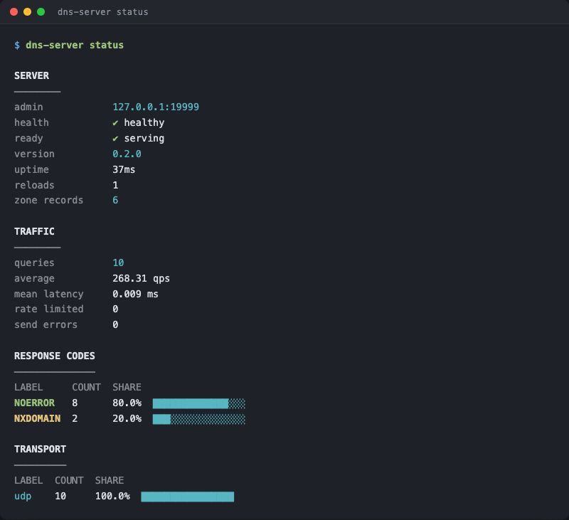
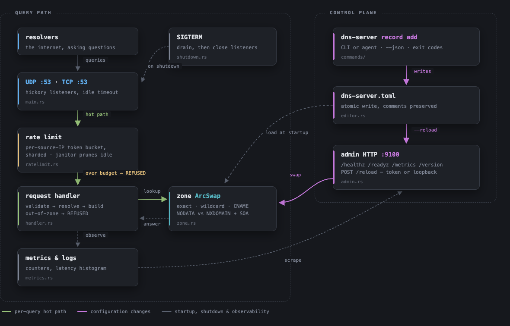

<div align="center">

# vega

**An authoritative DNS server written in Rust, driven entirely from the command line.**

[](https://github.com/ismoilovdevml/vega/actions/workflows/ci.yml)
[](https://github.com/ismoilovdevml/vega/actions/workflows/security.yml)
[](https://github.com/ismoilovdevml/vega/actions/workflows/docker.yml)
[](https://github.com/ismoilovdevml/vega/releases/latest)

[](LICENSE)
[](https://www.rust-lang.org)
[](https://hickory-dns.org)
[](https://github.com/ismoilovdevml/vega/pkgs/container/vega)
[](https://github.com/rust-secure-code/safety-dance)

</div>



---

## What this is

A single-zone authoritative name server. You describe a zone in one TOML file —
or build it up with `vega record add` — and it answers queries for that
zone over UDP and TCP. It is deliberately **not** a resolver: it never recurses,
never caches, and refuses anything outside its own zone.

It is built around one idea: **everything you need to run it is a subcommand.**
Create the config, add records, validate them, reload a live server, query it,
read its metrics — no editor, no `dig`, no `curl` required. Every command also
speaks `--json`, so scripts and agents drive it the same way you do.

```bash
vega init --origin example.com
vega record add www A 203.0.113.10 --bump-serial --reload
vega query www.example.com A
```

| | |
|---|---|
| **Records** | A, AAAA, CNAME, TXT, MX, NS, SRV, CAA, SOA and anything else Hickory parses, in zone-file syntax |
| **DNS correctness** | authoritative answers, wildcards, in-zone CNAME chasing, NODATA vs NXDOMAIN, SOA in the authority section, EDNS(0), TCP fallback |
| **Operations** | live zone reload with no dropped queries, a [`SIGTERM` drain](#shutdown-and-draining) that keeps answering while `/readyz` reports 503, `/healthz` `/readyz` `/metrics` `/version` |
| **Protection** | per-source-IP token bucket, `REFUSED` for out-of-zone queries, no dynamic UPDATE surface |
| **Observability** | Prometheus metrics, structured JSON logs, per-query latency histogram |
| **Deployment** | static musl binaries, distroless container, systemd unit, Compose and Kubernetes manifests |
| **Safety** | `unsafe_code = "forbid"`, clippy pedantic clean, 209 tests |

---

## Install

### One line

```bash
curl -fsSL https://raw.githubusercontent.com/ismoilovdevml/vega/main/install.sh | sh
```

Downloads the release binary for your platform, verifies its SHA-256 against the
published `SHA256SUMS`, and installs it to `/usr/local/bin`.

Add `--systemd` to also create the service user, a starter config in
`/etc/vega/`, and a hardened systemd unit — left **stopped** so you can
review the zone first:

```bash
curl -fsSL https://raw.githubusercontent.com/ismoilovdevml/vega/main/install.sh | sh -s -- --systemd
```

<details>
<summary>Other options</summary>

**Docker**

```bash
docker pull ghcr.io/ismoilovdevml/vega:latest
```

**From source** (needs Rust 1.88+)

```bash
cargo install --git https://github.com/ismoilovdevml/vega --locked
```

**Release archive**

Pick your platform from [releases](https://github.com/ismoilovdevml/vega/releases/latest),
then verify before you trust it:

```bash
sha256sum -c SHA256SUMS --ignore-missing
tar -xzf vega-v0.2.0-x86_64-unknown-linux-musl.tar.gz
```

**Shell completions**

```bash
vega completions bash | sudo tee /etc/bash_completion.d/vega
vega completions zsh  > ~/.zfunc/_vega
vega completions fish > ~/.config/fish/completions/vega.fish
```

</details>

---

## Quickstart

```bash
# 1. A config file, with a sensible SOA already filled in.
vega init --origin example.com

# 2. Records. Values use zone-file syntax, so MX looks like MX.
vega record add @   A     203.0.113.10 203.0.113.11
vega record add www CNAME example.com.
vega record add @   MX    "10 mail.example.com."
vega record add @   TXT   '"v=spf1 mx -all"'
vega record add '*.apps' A 203.0.113.30    # wildcard
vega record add api A 203.0.113.20 --ttl 30

# 3. Check before you serve. Exits non-zero if anything is wrong.
vega check

# 4. Serve. Port 53 needs privileges; use 1053 to try it out.
vega serve --udp 127.0.0.1:1053 --tcp 127.0.0.1:1053

# 5. In another shell:
vega query www.example.com A --server 127.0.0.1:1053
```

`query` prints what `dig` would, plus the timing and the wire size — and it tells
you *why* an empty answer is empty, which is usually the thing you are actually
trying to find out:



---

## The CLI

With no subcommand it serves. Every other subcommand manages or inspects.
`--json` works on all of them, and a command that changed nothing says
`unchanged` and still exits 0.

```text
vega                      run the server (same as `serve`)
vega init                 write a starter config
vega check                validate config + zone, print what would be served
vega serve                run the server

vega record list          list record sets  [--name N] [--type T]
vega record get NAME      show one name's records (exit 1 if absent)
vega record add NAME TYPE VALUE...   [--ttl] [--replace] [--bump-serial] [--reload]
vega record delete NAME [TYPE]       [--value V] [--bump-serial] [--reload]

vega zone show            origin, SOA serial, counts by type
vega zone export          BIND zone-file format, for diffing
vega zone bump-serial     set the serial to YYYYMMDDnn

vega query NAME [TYPE]    send a query  [--server ADDR] [--use-tcp]
vega status               health, version, uptime, traffic breakdown
vega reload               make a running server re-read its config
vega healthcheck          probe /healthz, exit 0 or 1

vega completions SHELL    bash | zsh | fish | powershell | elvish
```

`check` resolves the whole configuration, builds the zone, and tells you what
would be served — including the things that are easy to get wrong, like a missing
SOA or an admin listener on a public interface:



### Config discovery

Without `--config`, these are tried in order:

1. `./vega.toml`
2. `/etc/vega/vega.toml`
3. `/usr/local/etc/vega/vega.toml`



### Scripting and agents

Every command has a machine-readable form and a meaningful exit code, so there is
nothing to scrape:

```bash
# Is this record already there?
if vega record get www A --json >/dev/null; then
  echo "already configured"
fi

# What is live right now?
vega status --json | jq '.metrics["dns_queries_total"]'

# Idempotent apply: safe to run on every deploy.
vega record add www A "$NEW_IP" --replace --bump-serial --reload --json

# Did the query actually answer?
vega query www.example.com A --json | jq -r '.rcode'
```

Output honours [`NO_COLOR`](https://no-color.org), drops colour when stdout is
not a terminal, and never colours `--json`. Add `-v` for full detail: raw
counters in `status`, the additional section in `query`.

---

## Live reload

Editing records does not need a restart. The zone sits behind an atomic pointer,
so a reload swaps it with no lock on the query path and no dropped queries —
requests already in flight finish against the old zone.



If the edited config is invalid, **the reload is refused and the old zone keeps
serving** — a typo cannot take the server down.

Listener addresses and the rate limiter are not hot-swappable; changing those
needs a restart, and the server logs a warning if they drift.

`POST /reload` is gated, because it mutates state:

- **no `--admin-token`** → loopback callers only;
- **`--admin-token` set** → that bearer token is required, from anywhere.

---

## Configuration

Precedence: **CLI flag → environment variable → config file → default.**

<details>
<summary>Full example config</summary>

See [`vega.example.toml`](vega.example.toml) for the annotated
version. The short form:

```toml
[server]
udp = ["0.0.0.0:53", "[::]:53"]
tcp = ["0.0.0.0:53", "[::]:53"]
admin_listen = "127.0.0.1:9100"    # unauthenticated — keep it private
tcp_timeout_secs = 10
shutdown_drain_secs = 15           # keep answering this long after SIGTERM
log_format = "json"                # or "pretty"
log_level = "info"

[server.rate_limit]
qps = 50                           # per source IP; 0 disables
burst = 100                        # defaults to 2 * qps

[zone]
origin = "example.com"
default_ttl = 300
builtins = true                    # the diagnostic sub-zones, below

[zone.soa]
mname = "ns1.example.com."
rname = "hostmaster.example.com."
serial = 2026073001
minimum = 60                       # negative-cache TTL

[[zone.records]]
name = "@"                         # "@" = apex, "*.sub" = wildcard
type = "A"
ttl = 60                           # optional
values = ["203.0.113.10", "203.0.113.11"]
```

</details>

<details>
<summary>Flags and environment variables</summary>

| Flag | Environment | Meaning |
|---|---|---|
| `--config PATH` | `VEGA_CONFIG` | config file |
| `--udp ADDR` | `VEGA_UDP` | UDP listener; repeatable |
| `--tcp ADDR` | `VEGA_TCP` | TCP listener; repeatable |
| `--admin-listen ADDR` | `VEGA_ADMIN_LISTEN` | admin HTTP address |
| `--admin-token TOKEN` | `VEGA_ADMIN_TOKEN` | bearer token for `/reload` |
| `--domain ZONE` | `VEGA_DOMAIN` | zone origin |
| `--rate-limit-qps N` | `VEGA_RATE_LIMIT_QPS` | per-IP queries per second; `0` disables |
| `--rate-limit-burst N` | `VEGA_RATE_LIMIT_BURST` | bucket size |
| `--tcp-timeout-secs N` | `VEGA_TCP_TIMEOUT_SECS` | TCP idle timeout |
| `--shutdown-drain-secs N` | `VEGA_SHUTDOWN_DRAIN_SECS` | seconds to keep answering after `SIGTERM` while `/readyz` is 503; `0..=300`, default `15` |
| `--no-builtins` | `VEGA_NO_BUILTINS` | disable the diagnostic sub-zones |
| `--log-format FMT` | `VEGA_LOG_FORMAT` | `pretty` or `json` |
| `--log-level FILTER` | `VEGA_LOG_LEVEL` | `RUST_LOG` syntax |
| `--json` | — | machine-readable output |
| `--verbose`, `-v` | — | extra detail |

`RUST_LOG` overrides `--log-level` if both are set.

</details>

### Diagnostic sub-zones

Enabled by default; a fast way to prove a deployment works end to end. Turn them
off with `--no-builtins` if you would rather not expose server internals.

```bash
vega query version.example.com TXT           # "vega 0.2.0"
vega query counter.example.com TXT           # queries served so far
vega query myip.example.com A                # the client's own address
vega query anything.hello.example.com TXT    # "hello, anything"
```

---

## Running it in production

### Docker

```bash
docker run -d --name vega \
  --cap-drop ALL --cap-add NET_BIND_SERVICE \
  --read-only --security-opt no-new-privileges:true \
  -p 53:53/udp -p 53:53/tcp \
  -p 127.0.0.1:9100:9100 \
  -v "$PWD/vega.toml:/etc/vega/vega.toml:ro" \
  ghcr.io/ismoilovdevml/vega:latest \
  --config=/etc/vega/vega.toml
```

The image is [distroless](https://github.com/GoogleContainerTools/distroless):
no shell, no package manager, runs as uid 65532. Binding `:53` as a non-root user
needs exactly `NET_BIND_SERVICE` and nothing else. `HEALTHCHECK` works because
the binary probes its own `/healthz` — no curl in the image.

Stop it with `docker stop -t 30 vega`: the default 10 s timeout would `SIGKILL`
the container part way through the 15 s drain described
[below](#shutdown-and-draining).

Or use [`deploy/docker-compose.yml`](deploy/docker-compose.yml):

```bash
cp vega.example.toml deploy/vega.toml    # then edit it
docker compose -f deploy/docker-compose.yml up -d
```

### systemd

```bash
curl -fsSL https://raw.githubusercontent.com/ismoilovdevml/vega/main/install.sh | sh -s -- --systemd
sudo $EDITOR /etc/vega/vega.toml
sudo vega check --config /etc/vega/vega.toml
sudo systemctl enable --now vega
journalctl -u vega -f
```

The [unit](deploy/systemd/vega.service) runs as a dedicated user with
`CAP_NET_BIND_SERVICE` as its entire capability set, `ProtectSystem=strict`, a
seccomp filter, and `MemoryDenyWriteExecute=yes`. `ExecStartPre` validates the
config, so a typo fails the start instead of half-starting. `TimeoutStopSec=30`
with `KillMode=mixed` gives the [drain](#shutdown-and-draining) room to finish
before systemd escalates to `SIGKILL`.

> **`Address already in use` on :53?** `systemd-resolved` usually owns it.
> `sudo systemctl disable --now systemd-resolved`, or listen on another port.

### Kubernetes

```bash
kubectl apply -f deploy/kubernetes/vega.yaml
```

Two replicas, `readOnlyRootFilesystem`, all capabilities dropped, `httpGet`
probes against the admin port, a `PodDisruptionBudget`, and
`externalTrafficPolicy: Local` so the client IP survives — without it `myip.` and
the per-source rate limiter both see the node instead of the caller.

The rollout is `maxUnavailable: 0`, so a new pod is Ready before an old one is
told to stop, and the old one then [drains](#shutdown-and-draining) for 15 s
inside a 30 s grace period. `externalTrafficPolicy: Local` makes node removal
depend on your cloud load balancer's own health check, which is usually slower
than kube-proxy — if yours needs longer than 15 s, raise `shutdown_drain_secs`
and `terminationGracePeriodSeconds` together.

### Shutdown and draining

Stopping a name server is the risky part of every deploy: a process that exits
the instant it is asked to still holds a load balancer's endpoint, an anycast
route, or a resolver's cached address for seconds afterwards, and every query
that arrives in that gap is lost silently — you never receive it, so it never
appears in your own metrics.

`SIGTERM` therefore starts a **drain** rather than an exit:

| Phase | `/healthz` | `/readyz` | DNS | |
|---|---|---|---|---|
| `Serving` | 200 | 200 | answering | normal operation |
| `Draining` | 200 | **503** | **still answering** | `shutdown_drain_secs`, default 15s |
| `Stopping` | 200 | 503 | finishing in-flight | up to 1s |
| `Closing` | 200 | 503 | closed | admin server last, so probes stay answerable |

Readiness is the only traffic gate. `/healthz` stays 200 for the whole drain on
purpose: a draining process is alive, and a liveness probe that fails during a
drain gets the container restarted in the middle of it. Every admin response
carries `X-Vega-Phase`, and `/metrics` exports `dns_shutdown_phase` plus
`dns_shutdown_deadline_seconds` once a signal has arrived. `SIGINT` runs the
same sequence with a zero-length window, so Ctrl-C is still instant. A second
`SIGTERM` collapses the remaining window; `SIGKILL` remains the way to stop the
process immediately.

The timings are a system, not a set of independent knobs:

```text
W  = shutdown_drain_secs = 15s   drain window
S  = 5s                          stop budget (quiesce + socket close), fixed
D  = W + S = 20s                 hard deadline; exceeding it exits 3
Wd = D + 2 = 22s                 in-process watchdog, the guaranteed death
```

Every supervisor's grace period must therefore be **above 22 s**, and any
liveness probe must not be able to declare the process dead inside 20 s:

| | |
|---|---|
| Kubernetes | `terminationGracePeriodSeconds: 30`, liveness `periodSeconds 10 × failureThreshold 3 = 30s > 20s`, readiness `2s × 2` so the endpoint is withdrawn about 5 s into the drain |
| systemd | `TimeoutStopSec=30`, `KillMode=mixed`, `SendSIGKILL=yes` |
| Docker | `STOPSIGNAL SIGTERM`, `docker stop -t 30`, `stop_grace_period: 30s` in Compose (the 10 s default would `SIGKILL` mid-drain) |

There is deliberately **no `preStop` hook** in the Kubernetes manifest. `preStop`
runs *before* `SIGTERM`, so the process is still fully ready throughout it and
it cannot serve the 503 that actually removes the pod from rotation; it also
stacks with the in-process drain into a guaranteed `SIGKILL`. If your external
load balancer is slower than the drain — a cloud NLB health-checking every 10 s
is — raise `shutdown_drain_secs` and raise the grace period by the same amount.

`deploy/check-shutdown-invariants.sh` enforces all of these relationships and
runs in CI, so raising one number without the others fails the build rather
than a rollout:

```bash
./deploy/check-shutdown-invariants.sh
```

**Alerting.** A drain is a normal event, so alert on the drain that goes wrong,
not on the drain. Vega ships no alert rules — these are the two worth adding,
and both are quiet during a healthy rollout:

```promql
# A drain that is not going to finish: still draining with the hard deadline
# nearly spent, so the watchdog is about to exit(3) with queries in flight.
dns_shutdown_phase >= 2 and dns_shutdown_deadline_seconds < 2

# The zone is not being answered by anyone. This is the SLO — it stays quiet
# through a rollout, because a draining instance is still answering.
sum(rate(dns_queries_total[2m])) == 0        # for: 5m

# Restart loop: more resets than a rollout can explain.
resets(dns_uptime_seconds[15m]) > 2          # for: 5m
```

If you already alert on readiness (`kube_pod_status_ready == 0`) or on scrape
failure, give it a `for:` longer than the drain plus the grace period — 45 s at
these defaults — or every deploy pages you.

### Metrics

`GET /metrics` on the admin port, in Prometheus text format:

| Metric | Type | |
|---|---|---|
| `dns_queries_total` | counter | queries received |
| `dns_queries_by_transport_total{transport}` | counter | `udp`, `tcp`, `other` |
| `dns_responses_total{rcode}` | counter | `noerror`, `nxdomain`, `refused`, … |
| `dns_query_duration_seconds` | histogram | per-query latency |
| `dns_rate_limited_total` | counter | queries the limiter dropped |
| `dns_send_errors_total` | counter | failures writing a response |
| `dns_zone_records` | gauge | records currently loaded |
| `dns_uptime_seconds` | gauge | since start |
| `dns_shutdown_phase` | gauge | `0` starting, `1` serving, `2` draining, `3` stopping, `4` closing |
| `dns_shutdown_deadline_seconds` | gauge | seconds left before the hard deadline, once a signal has arrived |
| `dns_build_info{version}` | gauge | always 1 |

The pod annotations in the Kubernetes manifest already mark it for scraping. If
you just want a look, `status` renders the same data:



---

## How it works



The zone is the only thing shared between the two halves, and it is swapped
atomically — a reload never blocks a query, and a query never sees a half-applied
zone.


| Module | |
|---|---|
| [`config`](src/config.rs) | CLI + TOML, merged and validated at startup |
| [`zone`](src/zone.rs) | record store, wildcards, CNAME chasing, NODATA vs NXDOMAIN |
| [`handler`](src/handler.rs) | `RequestHandler`: validation, built-ins, response assembly |
| [`ratelimit`](src/ratelimit.rs) | sharded token bucket with a background janitor |
| [`metrics`](src/metrics.rs) | atomic counters, Prometheus exporter |
| [`admin`](src/admin.rs) | health, readiness, metrics, gated reload |
| [`commands`](src/commands/) | what each subcommand does |
| [`editor`](src/editor.rs) | format-preserving, atomic config edits |
| [`dnsclient`](src/dnsclient.rs) | the small `dig` behind `query` |
| [`ui`](src/ui.rs) | colour, tables, formatting |

A few decisions worth knowing about:

- **Out-of-zone queries get `REFUSED`, not `NXDOMAIN`.** We know nothing about
  other namespaces, and saying a name does not exist there would be a lie.
- **Negative answers carry the SOA.** Without it resolvers cannot cache an
  NXDOMAIN and will re-ask forever.
- **Config edits are atomic and comment-preserving.** `record add` writes to a
  temp file in the same directory, fsyncs, and renames — a crash mid-write cannot
  truncate a live zone, and your comments survive.
- **`panic = "abort"` in release.** A poisoned task should take the process down
  and let the supervisor restart it, not keep serving from a half-initialised
  state.

---

## Development

```bash
cargo test --all-features                                    # 209 tests
cargo clippy --all-targets --all-features -- -D warnings     # pedantic, clean
cargo fmt --all --check
cargo deny check                                             # licences + advisories
cargo run -- --config vega.example.toml check
```

Contributions are welcome — see [CONTRIBUTING.md](CONTRIBUTING.md). Security
issues should go through
[a private advisory](https://github.com/ismoilovdevml/vega/security/advisories/new),
not a public issue; see [SECURITY.md](SECURITY.md).

## Not implemented

Being explicit about the edges, so nothing surprises you in production:

- **DNSSEC signing.** Hickory supports it; this server does not expose it yet.
- **Recursion or forwarding.** By design. Point a resolver at this for its own
  zone only.
- **Zone transfers (AXFR/IXFR) and `NOTIFY`.** Secondaries cannot pull from this
  server; ship the config file instead.
- **Dynamic UPDATE.** `OpCode::Update` answers `NOTIMP`. Records change through
  the CLI, which is auditable.
- **Multiple zones per process.** One origin per instance; run more than one.
- **DoT / DoH / DoQ.** Plain DNS over UDP and TCP only.

## Built with

[hickory-dns](https://hickory-dns.org) · [tokio](https://tokio.rs) ·
[clap](https://docs.rs/clap) · [axum](https://docs.rs/axum) ·
[toml_edit](https://docs.rs/toml_edit) · [arc-swap](https://docs.rs/arc-swap) ·
[tracing](https://docs.rs/tracing)

## License

[MIT](LICENSE) © [Otabek Ismoilov](https://github.com/ismoilovdevml)
